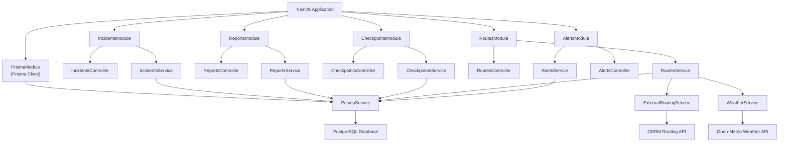
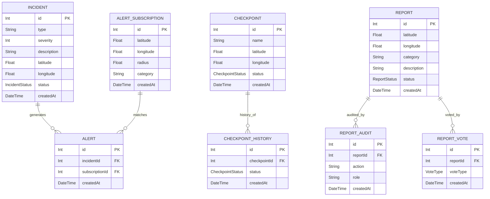

# WASEL Backend

## Project Overview

WASEL is a NestJS backend service for incident reporting, checkpoint management, alert subscriptions, and route estimation. It supports traffic-awareness and emergency-response workflows by combining local database records with external routing and weather data.

The backend is implemented using:
- NestJS modular architecture
- Prisma ORM with PostgreSQL
- DTO-based request validation
- Role-based guards for protected operations
- External routing and weather APIs for route estimation
- Performance testing with k6

## System Overview

The application is organized by domain modules:

- `IncidentsModule`: handles incident lifecycle, status changes, and retrieval
- `ReportsModule`: handles report submission, voting, approval, and audit logging
- `CheckpointsModule`: handles checkpoint creation, updates, deletion, and history
- `RoutesModule`: provides route estimates using external APIs plus local impact factors
- `AlertsModule`: manages alert subscriptions and alert queries
- `PrismaModule`: provides shared database access across modules

The API is exposed under a global prefix configured in `src/main.ts`:

- Base path: `/api/v1`

## Architecture Diagram



The architecture follows a layered design: controllers receive HTTP requests and delegate to services, services apply business logic and call Prisma for data access, and Prisma communicates with the database. The modular design keeps each feature isolated and reusable while preserving a clear separation of concerns.

## Database Schema (ERD)

The data model is defined in `prisma/schema.prisma` and includes these main entities:



### Entity Summary

- **Incident**: Stores active incidents, location, severity, and current status.
- **Checkpoint**: Stores checkpoint location, name, and status.
- **CheckpointHistory**: Records historical status transitions.
- **Report**: Stores user-submitted reports and approval status.
- **ReportAudit**: Logs admin/moderator approval or rejection actions.
- **ReportVote**: Stores report votes and supports popularity scoring.
- **AlertSubscription**: Stores area subscriptions for alerts.
- **Alert**: Connects incidents to subscription alerts.

## API Design Rationale

The API follows RESTful principles with a modular architecture:

- Clear, versioned base path: `/api/v1`
- Resource-oriented paths for each domain
- Consistent use of HTTP verbs: `GET` for reads, `POST` for creation/actions, `PATCH` for updates, `DELETE` for removal
- Strong request validation through NestJS DTOs and global `ValidationPipe`
- Role-based guard enforcement for admin/moderator-only actions

### Primary Endpoints

- `POST /api/v1/incidents` — create a new incident (protected)
- `GET /api/v1/incidents` — list incidents with filtering and pagination
- `GET /api/v1/incidents/:id` — retrieve a single incident
- `PATCH /api/v1/incidents/:id` — update an incident (protected)
- `PATCH /api/v1/incidents/:id/verify` — verify an incident (protected)
- `PATCH /api/v1/incidents/:id/close` — close an incident (protected)
- `DELETE /api/v1/incidents/:id` — remove an incident (protected)

- `POST /api/v1/reports` — submit a report
- `GET /api/v1/reports` — retrieve report listings
- `GET /api/v1/reports/:id` — retrieve a report with vote counts
- `POST /api/v1/reports/:id/vote` — vote on a report
- `PATCH /api/v1/reports/:id/approve` — approve a report (protected)
- `PATCH /api/v1/reports/:id/reject` — reject a report (protected)

- `POST /api/v1/checkpoints` — create a checkpoint (protected)
- `GET /api/v1/checkpoints` — list checkpoints
- `GET /api/v1/checkpoints/:id` — retrieve checkpoint details
- `GET /api/v1/checkpoints/:id/history` — retrieve checkpoint history
- `PATCH /api/v1/checkpoints/:id` — update a checkpoint (protected)
- `DELETE /api/v1/checkpoints/:id` — delete a checkpoint (protected)

- `GET /api/v1/routes/estimate` — estimate route distance, duration, and delay factors

- `POST /api/v1/alerts/subscriptions` — create alert subscription
- `GET /api/v1/alerts/subscriptions` — list subscriptions
- `GET /api/v1/alerts` — query alerts

## External API Integration Details

The route estimation flow combines local state with external APIs.

### OSRM Routing API

- Uses `http://router.project-osrm.org/route/v1/driving/...`
- Retrieves base distance and duration for route segments
- Has a 3-second timeout to avoid blocking route responses
- Falls back to internal distance and duration calculations when unavailable

### Open-Meteo Weather API

- Uses `https://api.open-meteo.com/v1/forecast` with current weather
- Maps weather codes to conditions such as `clear`, `rain`, `snow`, `storm`, and `cloudy`
- Applies weather impact scoring to route estimates
- Uses fallback logic when weather data cannot be retrieved

### Route Risk Calculation

Route estimates are enriched by:
- local incident density along the route
- nearby checkpoints along the route
- external routing duration
- weather impact scores

This layered approach ensures route results blend external guidance with local situational awareness.

The core system is designed to work without external APIs; routing and weather providers are used only to enhance route estimation and user experience.

## Testing Strategy

### Unit Tests

- Uses Jest for service, controller, and guard unit tests
- Tests should verify domain logic, validation rules, and error handling
- Run with:

```bash
npm run test
```

### End-to-End Tests

- Uses NestJS test utilities and SuperTest for full integration coverage
- Verifies the full request lifecycle from incoming HTTP request to database persistence
- Run with:

```bash
npm run test:e2e
```

### Validation

- Global `ValidationPipe` in `src/main.ts` enforces DTO contracts
- This prevents malformed requests and unknown payload fields

### Performance Testing

- Load tests live in `performance-tests/`
- Built with k6
- Designed to measure read-heavy, write-heavy, mixed load, spike, and soak behavior

Testing in this project ensures correctness, reliability, and performance across the backend implementation.

## Performance Testing Results

### Read-Heavy

- Load: 100 VUs over 5 minutes
- Checks: 100% succeeded
- p95 latency: ~1.64ms
- Average duration: ~1.12ms

### Write-Heavy

- Load: 50 VUs over 3 minutes
- Checks: 100% succeeded
- p95 latency: ~21.95ms
- Average duration: ~16.09ms

### Mixed Load

- Load: 200 VUs over 5 minutes
- Check success: 95.14%
- Threshold breach: route estimates exceeded 800ms for some requests
- p95 latency: ~3.08s
- This indicates external route/weather integration is the main stress point under mixed load

### Spike Test

- Load: up to 500 VUs over 30 seconds
- Checks: 100% succeeded
- p95 latency: ~1.59s
- The system handled sudden load spikes without failed checks

### Soak Test

- Load: 50 VUs over ~60 minutes
- Checks: 99.98% succeeded
- p95 latency: ~2ms
- 68 request failures out of 179,850 total requests, showing strong long-term stability

## Docker Deployment

A Docker Compose setup can be used to run the app and database together in a consistent environment. The Compose configuration should define two services:

- `app`: the NestJS application container
- `db`: a PostgreSQL database container

These services communicate internally over Docker networking using `db:5432`, while the application remains accessible externally on `localhost` through the mapped port. Docker is used to provide consistency across environments, isolate dependencies, and simplify local development.

## Getting Started

### Prerequisites

- Node.js 18+ or later
- PostgreSQL
- npm

### Install Dependencies

```bash
npm install
```

### Database Setup

Set `DATABASE_URL` in `.env`, then run:

```bash
npx prisma generate
```

### Start Development Server

```bash
npm run start:dev
```

The backend will be available at:

```text
http://localhost:3000/api/v1
```

### Run a Performance Test

```bash
cd performance-tests
k6 run read-heavy.js
```

## Project Structure

- `src/app.module.ts` — application root and module composition
- `src/main.ts` — startup, global API prefix, and global validation
- `src/prisma` — Prisma module and database service
- `src/incidents` — incident endpoints, service, DTOs, types
- `src/reports` — report workflows and audit/vote handling
- `src/checkpoints` — checkpoint CRUD and history tracking
- `src/routes` — route estimation and external integrations
- `src/alerts` — alert subscription and retrieval
- `src/guards` — role-based authorization
- `src/decorators` — role metadata helper

## Future Improvements

- Add authentication and JWT-based authorization
- Replace header-based role access with secure identity management
- Cache external API responses for routing and weather data
- Add database indexing for performance
- Add retry and circuit breaker handling for external providers
- Build migrations and seed data for repeatable local development

---

*This README documents the WASEL backend system architecture, database schema, API design, external integrations, testing regimen, and performance profile.*
